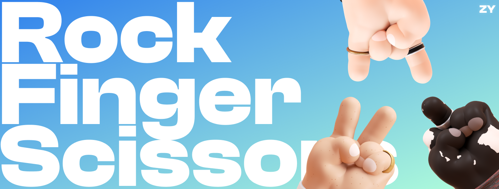

# RockFingerScissors 
⚠️ **Mobile version is not supported yet** ⚠️

## Todo
- [x] Working smart-contract
- [x] DApp design and functionality
- [ ] Game history
- [ ] Responsiveness

## Overview

RockFingerScissors is a decentralized application (dApp) built on the Binance Smart Chain Testnet that allows users to play a game of rock-paper-scissors against the smart contract. The smart contract for the game is written in Solidity and the front-end dApp is created with Next.js.

Game is deployed to following networks:
- [x] BSC Testnet
- [ ] Mantle Testnet
- [ ] ConsenSys zkEVM Testnet

## Game Concept

The concept of the game is no different from a simple rock-paper-scissors game (paper is replaces by finger). The user selects between rock, finger or scissors, and then calls the `play(_choice)` method in the smart contract, sending `0.001 TBNB` as a default bet. The smart contract then randomly generates a number between 1 and 3, with 1 representing rock, 2 - finger and 3 - scissors. If the user's choice beats the randomly generated number, the user wins and receives double of the bet in return.

## Rules
Rules are simple:

- Rock > Scissors
- Scissors > Finger
- Finger > Rock

## Getting Started

To play the game, the user needs to have a wallet that supports the Binance Smart Chain and has some TBNB (the native token of the Binance Smart Chain Testnet) in it. The user can then connect their wallet to the dApp and play the game.

## Project Structure

The project is structured as a yarn monorepo

- `dapp` - RockFingerScissors Next.js front-end dApp
- `contract` - RockFingerScissors smart-contract built with Solidity
